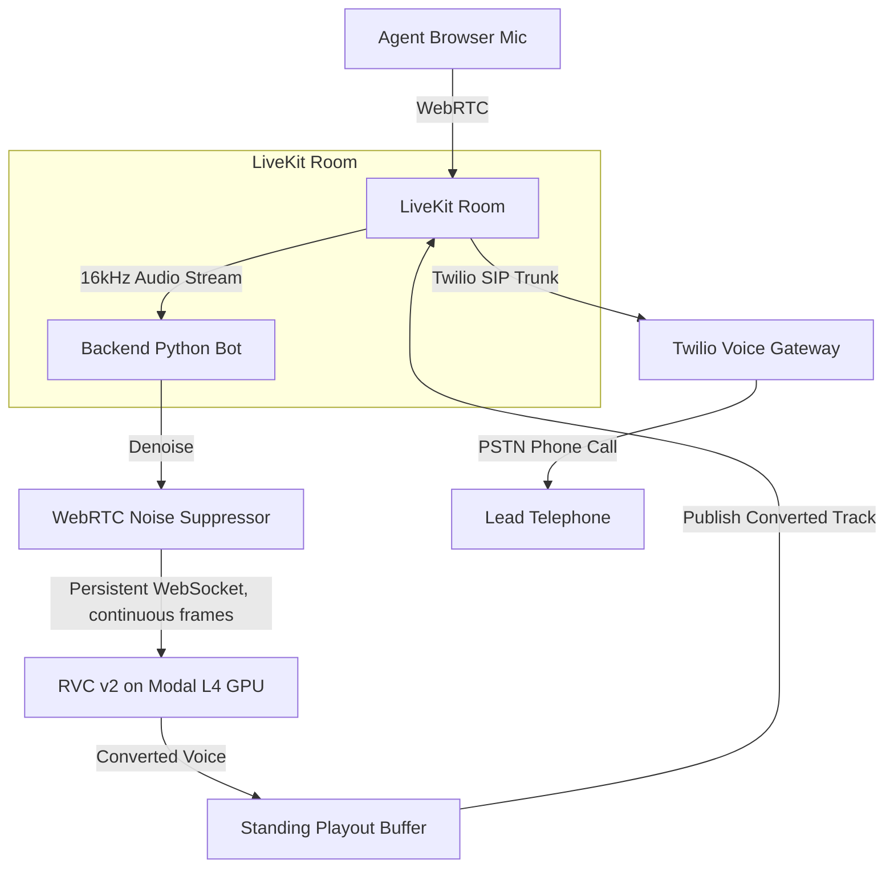

# Keira — Browser-to-Phone Real-Time Voice Conversion Softphone

Keira is a high-performance, real-time voice conversion platform designed for telecalling. It allows agents to speak from a browser dashboard and stream their voice with a consistent "brand voice" to leads on normal telephone lines.

---

## 1. Architecture



- **Browser-to-Phone**: Agents dial leads directly from a clean dark glassmorphism dashboard. Incoming calls dial in from the PSTN, trigger a Twilio webhook, and are routed via SIP into a LiveKit room.
- **Brand Voice Conversion**: Agent audio is captured at 16kHz, denoised, and streamed continuously over a persistent WebSocket to a serverless L4 GPU running RVC v2 on Modal (optionally accelerated with TensorRT). Converted 48kHz audio is returned, held in a standing playout buffer, and published into the room.
- **One-Way Conversion**: Voice conversion is applied only to the agent-to-lead stream. The lead-to-agent stream is bridged directly and unmodified so the agent hears the lead's raw voice.
- **Fail-Closed, Never Raw**: There is no raw-voice fallback — it was removed structurally. If the GPU connection drops or errors, the bot publishes silence until real converted audio resumes; the lead never hears the agent's unconverted voice. A standing playout buffer (0.25s target/5s cap) absorbs jitter, then drains in bounded 100ms chunks to avoid gulping long utterances. See [CLAUDE.md](CLAUDE.md) and
[wiki/pages/concepts/adaptive-playout-buffer.md](wiki/pages/concepts/adaptive-playout-buffer.md) for the full mechanism.

### Current RVC rollout state (2026-07-16)

- **Production default remains RVC baseline**: 320ms block, 400ms context, 80ms SOLA,
  and 250ms playout target. Modal reports an L4, TensorRT, a hot engine cache, and an
  artifact-derived model/index fingerprint.
- The existing `fastapi_app` endpoint remains the stable rollback path. A separate
  `fastapi_app_ap` endpoint was deployed for routing experiments; it uses Modal's
  `ap-south` input edge and broad `ap` GPU placement.
- Render is in Singapore and has **not** been switched to the experimental endpoint.
  Benchmark the WebSocket from the Render service before changing `RVC_ENDPOINT_URL`;
  results from a developer laptop measure a different network path.
- LLVC training/deployment is paused. Its converter, safety, and benchmarking scaffolding
  was removed from `main` on 2026-07-16 and set aside on branch `codex/llvc-pilot` for a
  later zero-shot/streaming-model evaluation — it is not part of this tree.

---

## 2. Prerequisites & Setup

To run the complete Keira telephony MVP, you need the following accounts:

1. **LiveKit Cloud**: Sign up at [LiveKit Cloud](https://cloud.livekit.io) to obtain a WebRTC URL and API credentials.
2. **Twilio**: Create a [Twilio account](https://www.twilio.com) for telephone numbers, SIP routing, and credential generation.
3. **Modal**: Sign up at [Modal](https://modal.com) to deploy the serverless RVC GPU worker.

### Twilio SIP Configuration
1. Buy a voice-capable phone number in Twilio.
2. Set up an **Elastic SIP Trunk** in the Twilio Console (Voice > Manage > Elastic SIP Trunks).
3. Register your LiveKit Cloud project's SIP domain (e.g. `{project-subdomain}.sip.livekit.cloud`) as an **Origination URI** on the trunk.
4. Obtain the **SIP Trunk ID** in LiveKit Cloud dashboard after registering Twilio under the Telephony config.

---

## 3. Environment Variables Reference

Create a `.env` file in the root directory:

```bash
# LiveKit Media Server
LIVEKIT_URL=wss://your-project.livekit.cloud
LIVEKIT_API_KEY=your_livekit_api_key
LIVEKIT_API_SECRET=your_livekit_api_secret

# RVC Serverless GPU
RVC_ENDPOINT_URL=https://your-modal-app--rvc-convert.modal.run
RVC_API_KEY=your_modal_secret_value # must match the Modal rvc-api-key secret
RVC_PITCH_SHIFT=0 # fallback semitones; dashboard selects male/female per call
RVC_INDEX_RATE=0.9 # FAISS-retrieved timbre mix; defaults to 0.9 if unset
RVC_WS_URL= # optional explicit /ws URL override; derived from RVC_ENDPOINT_URL if unset
RVC_KEEPWARM=0 # read at backend startup; changing it on Render restarts the service
RVC_ADAPTIVE_PITCH=1 # per-call F0-derived pitch lock; 0 = legacy fixed RVC_MALE_PITCH_SHIFT only
RVC_TARGET_F0=208 # Hz center of the trained model's pitch range the adaptive lock targets
PRESENCE_EQ_GAIN_DB=4 # dB boost on 1.2-3.4kHz before publish (PSTN clarity); 0 disables

# CORS (comma-separated; defaults to "*" if unset)
CORS_ORIGINS=*

# Twilio Telephony Credentials
TWILIO_ACCOUNT_SID=ACxxxxxxxxxxxxxxxxxxxxxxxx
TWILIO_AUTH_TOKEN=your_twilio_auth_token
TWILIO_PHONE_NUMBER=+15550000000
TWILIO_SIP_URI=your-project.pstn.twilio.com
TWILIO_SIP_TRUNK_ID=STxxxxxxxxxxxxxxxxxxxxxxxx
TWILIO_SIP_USERNAME=Keira # defaults to "Keira" if unset
TWILIO_SIP_PASSWORD=your_sip_password

# Server / Modal deploy trigger
SERVER_URL=https://your-deployed-server.example.com
MODAL_TOKEN_ID=your_modal_token_id
MODAL_TOKEN_SECRET=your_modal_token_secret
```

---

## 4. How to Train & Deploy the RVC Voice Model

### Training an RVC v2 Model
1. Collect 10–30 minutes of high-quality, dry (no reverb/background noise) audio of your target brand voice.
2. Use the [Retrieval-based Voice Conversion WebUI](https://github.com/RVC-Project/Retrieval-based-Voice-Conversion-WebUI) to train an RVC v2 model.
3. Export the trained generator weight (`your_voice.pth`) and retrieval index (`your_voice.index`).

### Deploying to Modal
1. Install Modal and log in:
   ```bash
   pip install modal
   modal token new
   ```
2. Create a Modal volume and upload your model weights:
   ```bash
   modal volume create rvc-models
   modal volume put rvc-models your_voice.pth /models/your_voice.pth
   modal volume put rvc-models your_voice.index /models/your_voice.index
   ```
3. Set your RVC API key secret on Modal:
   Create a secret named `rvc-api-key` in your Modal dashboard containing `RVC_API_KEY`.
4. Deploy the GPU worker:
   ```bash
   RVC_STREAM_PROFILE=baseline modal deploy modal_deploy/worker.py
   ```
   Copy the deployed `/convert` URL (e.g. `https://your-app--rvc-worker-fastapi-app.modal.run/convert`) and paste it as `RVC_ENDPOINT_URL` in your `.env`.

---

## 5. Running Keira Locally

1. **Virtual Environment Setup**:
   ```bash
   python3 -m venv .venv
   source .venv/bin/activate
   pip install -r backend/requirements.txt
   ```

2. **Verify Setup**:
   Run the automated test pipeline to check WebRTC denoising, Dummy converter, and RVC mocks:
   ```bash
   python -m backend.test_pipeline
   ```

3. **Start the Server**:
   Launch the FastAPI backend (which also hosts the agent dashboard):
   ```bash
   uvicorn backend.main:app --reload --port 8000
   ```

4. **Access the Dashboard**:
   Open **`http://localhost:8000`** in your browser. Click **Warm GPU** before selecting a lead to call.

### Desktop voice changer for WhatsApp Desktop (Windows)

The `/desktop/` page sends **converted audio only** to a Windows virtual audio device;
it never exposes `RVC_API_KEY` to the browser. Use current Chrome or Edge on Windows,
which must support microphone access, AudioWorklets, and `AudioContext.setSinkId`.

Operator/control routes are currently unauthenticated (see "Current control-plane rules"
in [CLAUDE.md](CLAUDE.md)); no control token is required for the desktop page or any other
control route. `python scripts/run_local.py` remains available for binding Keira to a
loopback origin during local development.

1. Install [VB-CABLE](https://vb-audio.com/Cable/) on the Windows workstation, then
   restart the browser so Windows exposes both cable endpoints.
2. Start Keira and open `https://your-keira-server.example.com/desktop/` (or
   `http://localhost:8000/desktop/` for local development). Grant the browser's
   microphone permission when prompted; this is required before the device names can
   be listed.
3. In the Keira page, choose the **physical microphone** as **Physical microphone** and
   choose **CABLE Input**, **BlackHole 2ch**, or **Loopback** as **Converted output**.
   Do not select **CABLE Output** or another virtual loopback as the Keira input: that
   creates a feedback/raw-routing risk. Start conversion and wait for the relay to reach
   `ready`/`converting` before beginning a call.
4. In WhatsApp Desktop's audio settings, set **Microphone** to **CABLE Output** and set
   **Speakers** to the agent's headphones (not either VB-CABLE endpoint). The cable maps
   Keira's selected **CABLE Input** playback to WhatsApp's **CABLE Output** microphone.
5. Use **Test converted voice** before the first call. It plays converted-only audio
   through normal speakers; it does not route the physical microphone directly to a
   device.

Keira is fail-closed: if the conversion relay or its upstream conversion connection
interrupts, it stops the relay and the WhatsApp recipient receives silence until a clean
converted session is started. Raw microphone audio is never used as a fallback.

For a Windows acceptance run, make one ten-minute WhatsApp Desktop call and record the
exact device labels, model-ready time, median and P95 mouth-to-ear latency, input and
playout drops, underruns, and duration drift. During that call, interrupt the network and
unplug/reconnect the microphone; confirm that the recipient hears silence during each
conversion interruption. After reconnecting the microphone, the operator must click
**Stop**, start a new conversion session (which obtains a new ticket), and then verify
clean converted-audio recovery. This repository's automated tests and local static checks
do not substitute for that device-specific validation.

### Desktop verification evidence (2026-07-23)

- `node --test frontend/desktop/audio_protocol.test.mjs` — 10 tests passed.
- `node --test frontend/desktop/desktop.test.mjs` — 4 tests passed.
- `node --check frontend/desktop/desktop.js` and
  `.venv/bin/python -m py_compile backend/test_desktop_audio.py` — passed.
- `python -m pytest backend/test_pipeline.py backend/test_streaming_safety.py backend/test_call_safety.py backend/test_control_plane.py backend/test_desktop_audio.py -q` could not run because this macOS workspace has no `python` alias. The equivalent `.venv/bin/python` command was blocked by missing `pytest-asyncio` (or another async pytest plugin): 41 tests passed and 20 async pipeline tests failed before execution.
- No live Windows/VB-CABLE/WhatsApp Desktop call was performed; the acceptance run above remains required on the target workstation.

---

## 6. How to Test & Measure Latency

### RVC WebSocket benchmark

Run the same synthetic, call-long stream against the endpoint configured in `.env`:

```bash
python -m scripts.rvc_stream_benchmark --duration 9.6
```

The command reports active-session readiness, TensorRT inference, converter wait,
estimated network time, duration delta, profile/model metadata, and all drop counters.
It opens one conversion session and never uses customer audio.

The first live baseline run on 2026-07-16 measured 30 blocks:

| Metric | Result |
|---|---:|
| Active-session readiness from cold | 72,510.73ms |
| TensorRT inference median / p95 | 50.75ms / 51.61ms |
| Converter wait median / p95 | 1,207.11ms / 1,358.56ms |
| Estimated network component median / p95 | 837.05ms / 988.91ms |
| Output duration delta | -211.46ms over 9.6s |
| Input/output/connection drops | 0 / 0 / 0 |

These are **developer-laptop → Modal** measurements, not production mouth-to-ear
measurements. The large network term exposed Modal's default Virginia routing on the
legacy function; the parallel AP-routed endpoint exists to measure that variable from the
actual Render Singapore origin. The duration loss is also an open quality gate. See
[wiki/pages/concepts/audio-pipeline-latency-budget.md](wiki/pages/concepts/audio-pipeline-latency-budget.md)
for interpretation and remaining tests.

### Automatic Spectral Latency Test
The application includes a built-in digital latency analyzer that runs in the browser, eliminating acoustic feedback and measuring delay with millisecond precision:

1. Open `http://localhost:8000` in **two separate browser tabs** (or on two separate devices to avoid physical microphone feedback).
2. Click **Spawn Bot** in the Room Setup panel.
3. On Tab 1 (or Device 1), click **Join as Agent** and allow mic permissions.
4. On Tab 2 (or Device 2), click **Join as Listener**. (Ensure speakers are on).
5. In the Agent panel (Tab 1), click **Play Latency Test Tone**.
6. The Listener tab (Tab 2) will detect the 1kHz beep on the raw stream and the converted stream, displaying the exact **Mouth-to-Ear Latency** instantly.

For physical loopback tests (clap test) and details on the latency budget, see
[wiki/pages/concepts/audio-pipeline-latency-budget.md](wiki/pages/concepts/audio-pipeline-latency-budget.md).

---

## 7. Codebase Extensions (Pluggability)

- **Swapping Voice Converters**: To add a new engine (e.g. Respeecher or local RVC), subclass `VoiceConverter` in `backend/converters/base.py` and register it in `backend/main.py`.
- **Compiling RNNoise locally**: We provide a script to download and compile the original C-based RNNoise package natively on your Mac (which places `librnnoise.dylib` in `backend/libs/`):
  ```bash
  ./scripts/build_rnnoise.sh
  ```
  Once compiled, the backend can be configured to use `RNNoiseSuppressor` instead of `WebRTCNoiseSuppressor`.

---

## 8. Staging Migration Guide

When deploying this project to staging or production environments, complete the following configuration steps:

### 1. Twilio Webhook URL Update
> **Note**: When moving to staging, update Twilio webhook URL from ngrok to real HTTPS domain.

* **Exact Location in Twilio Console**:
  1. Log in to the [Twilio Console](https://console.twilio.com/).
  2. Navigate to **Phone Numbers** > **Manage** > **Active Numbers**.
  3. Click on your active phone number.
  4. Scroll down to the **Voice & Fax** section.
  5. Under **A CALL COMES IN**, select **Webhook** from the dropdown.
  6. Replace the temporary ngrok URL in the text box with your real staging/production HTTPS domain (e.g., `https://your-staging-domain.com/twilio/voice`) and set HTTP method to `HTTP POST`.

### 2. LiveKit SIP Ingress Address Verification
> **Note**: LiveKit SIP ingress address may differ between environments — re-verify in LiveKit Cloud dashboard.

* **Verification Steps**:
  1. Log in to your [LiveKit Cloud Dashboard](https://cloud.livekit.io/) (or your staging LiveKit server instance).
  2. Select your staging/production project.
  3. Navigate to **SIP** / **Ingress Settings** (or Project Settings > Keys) to retrieve the environment's specific SIP ingress address and credentials.
