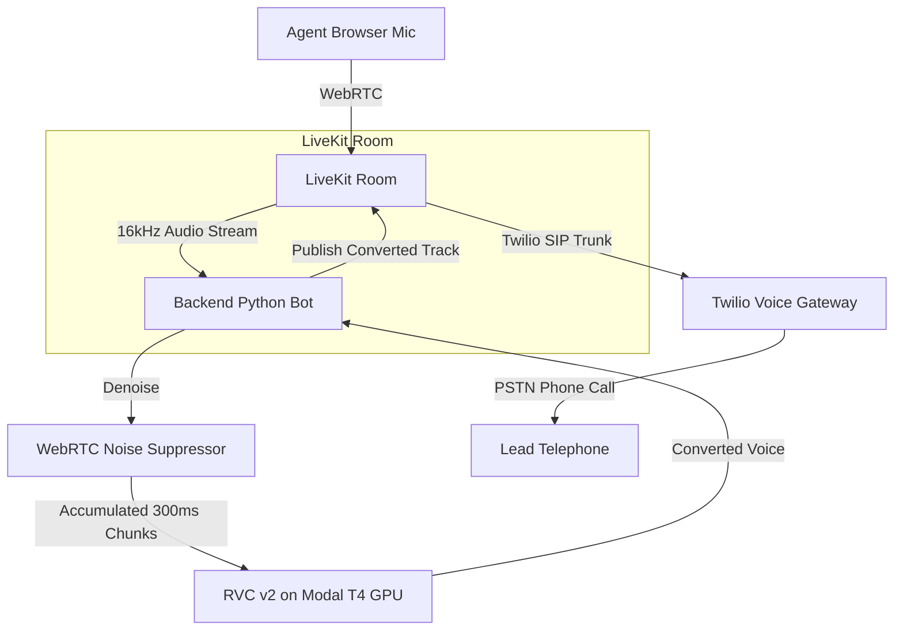

# Keira — Browser-to-Phone Real-Time Voice Conversion Softphone

Keira is a high-performance, real-time voice conversion platform designed for telecalling. It allows agents to speak from a browser dashboard and stream their voice with a consistent "brand voice" to leads on normal telephone lines.

---

## 1. Architecture



- **Browser-to-Phone**: Agents dial leads directly from a clean dark glassmorphism dashboard. Incoming calls dial in from the PSTN, trigger a Twilio webhook, and are routed via SIP into a LiveKit room.
- **Brand Voice Conversion**: Agent audio is captured at 16kHz, denoised, and sent to a serverless T4 GPU running RVC v2 on Modal. Converted 48kHz audio is returned, framed, and published into the room.
- **One-Way Conversion**: Voice conversion is applied only to the agent-to-lead stream. The lead-to-agent stream is bridged directly and unmodified so the agent hears the lead's raw voice.
- **Low-Latency Fail-Safe**: If RVC processing exceeds the budget timeout (5000ms) or fails, the bot falls back to streaming the raw denoised agent voice (resampled to 48kHz) to keep the call smooth.

---

## 2. Prerequisites & Setup

To run the complete Keira telephony MVP, you need the following accounts:

1. **LiveKit Cloud**: Sign up at [LiveKit Cloud](https://cloud.livekit.io) to obtain a WebRTC URL and API credentials.
2. **Twilio**: Create a [Twilio account](https://www.twilio.com) for telephone numbers, SIP routing, and credential generation.
3. **Modal**: Sign up at [Modal](https://modal.com) to deploy the serverless RVC GPU worker.

### Twilio SIP Configuration
1. Buy a voice-capable phone number in Twilio.
2. Set up an **Elastic SIP Trunk** in the Twilio Console (Voice > Manage > Elastic SIP Trunks).
3. Register your LiveKit Cloud project's SIP domain (e.g. `{project-subdomain}.sip.livekit.cloud`) as an **Origination URI** on the trunk.
4. Obtain the **SIP Trunk ID** in LiveKit Cloud dashboard after registering Twilio under the Telephony config.

---

## 3. Environment Variables Reference

Create a `.env` file in the root directory:

```bash
# LiveKit Media Server
LIVEKIT_URL=wss://your-project.livekit.cloud
LIVEKIT_API_KEY=your_livekit_api_key
LIVEKIT_API_SECRET=your_livekit_api_secret

# RVC Serverless GPU
RVC_ENDPOINT_URL=https://your-modal-app--rvc-convert.modal.run
RVC_API_KEY=your_custom_api_key
RVC_PITCH_SHIFT=0 # Semitones (e.g. +2 to raise pitch, -2 to lower)

# Twilio Telephony Credentials
TWILIO_ACCOUNT_SID=ACxxxxxxxxxxxxxxxxxxxxxxxx
TWILIO_AUTH_TOKEN=your_twilio_auth_token
TWILIO_PHONE_NUMBER=+15550000000
TWILIO_SIP_TRUNK_ID=STxxxxxxxxxxxxxxxxxxxxxxxx
```

---

## 4. How to Train & Deploy the RVC Voice Model

### Training an RVC v2 Model
1. Collect 10–30 minutes of high-quality, dry (no reverb/background noise) audio of your target brand voice.
2. Use the [Retrieval-based Voice Conversion WebUI](https://github.com/RVC-Project/Retrieval-based-Voice-Conversion-WebUI) to train an RVC v2 model.
3. Export the trained generator weight (`your_voice.pth`) and retrieval index (`your_voice.index`).

### Deploying to Modal
1. Install Modal and log in:
   ```bash
   pip install modal
   modal token new
   ```
2. Create a Modal volume and upload your model weights:
   ```bash
   modal volume create rvc-models
   modal volume put rvc-models your_voice.pth /models/your_voice.pth
   modal volume put rvc-models your_voice.index /models/your_voice.index
   ```
3. Set your RVC API key secret on Modal:
   Create a secret named `rvc-api-key` in your Modal dashboard containing `RVC_API_KEY`.
4. Deploy the GPU worker:
   ```bash
   modal deploy modal_deploy/worker.py
   ```
   Copy the deployed `/convert` URL (e.g. `https://your-app--rvc-worker-fastapi-app.modal.run/convert`) and paste it as `RVC_ENDPOINT_URL` in your `.env`.

---

## 5. Running Keira Locally

1. **Virtual Environment Setup**:
   ```bash
   python3 -m venv .venv
   source .venv/bin/activate
   pip install -r backend/requirements.txt
   ```

2. **Verify Setup**:
   Run the automated test pipeline to check WebRTC denoising, Dummy converter, and RVC mocks:
   ```bash
   python -m backend.test_pipeline
   ```

3. **Start the Server**:
   Launch the FastAPI backend (which also hosts the agent dashboard):
   ```bash
   uvicorn backend.main:app --reload --port 8000
   ```

4. **Access the Dashboard**:
   Open **`http://localhost:8000`** in your browser. Click **Start Shift** to warm up the RVC GPU container, and then select a lead to call.

---

## 6. How to Test & Measure Latency

### Automatic Spectral Latency Test
The application includes a built-in digital latency analyzer that runs in the browser, eliminating acoustic feedback and measuring delay with millisecond precision:

1. Open `http://localhost:8000` in **two separate browser tabs** (or on two separate devices to avoid physical microphone feedback).
2. Click **Spawn Bot** in the Room Setup panel.
3. On Tab 1 (or Device 1), click **Join as Agent** and allow mic permissions.
4. On Tab 2 (or Device 2), click **Join as Listener**. (Ensure speakers are on).
5. In the Agent panel (Tab 1), click **Play Latency Test Tone**.
6. The Listener tab (Tab 2) will detect the 1kHz beep on the raw stream and the converted stream, displaying the exact **Mouth-to-Ear Latency** instantly.

For physical loopback tests (clap test) and details on the latency budget, see [LATENCY.md](LATENCY.md).

---

## 7. Codebase Extensions (Pluggability)

- **Swapping Voice Converters**: To add a new engine (e.g. Respeecher or local RVC), subclass `VoiceConverter` in `backend/converters/base.py` and register it in `backend/main.py`.
- **Compiling RNNoise locally**: We provide a script to download and compile the original C-based RNNoise package natively on your Mac (which places `librnnoise.dylib` in `backend/libs/`):
  ```bash
  ./scripts/build_rnnoise.sh
  ```
  Once compiled, the backend can be configured to use `RNNoiseSuppressor` instead of `WebRTCNoiseSuppressor`.

---

## 8. Staging Migration Guide

When deploying this project to staging or production environments, complete the following configuration steps:

### 1. Twilio Webhook URL Update
> **Note**: When moving to staging, update Twilio webhook URL from ngrok to real HTTPS domain.

* **Exact Location in Twilio Console**:
  1. Log in to the [Twilio Console](https://console.twilio.com/).
  2. Navigate to **Phone Numbers** > **Manage** > **Active Numbers**.
  3. Click on your active phone number.
  4. Scroll down to the **Voice & Fax** section.
  5. Under **A CALL COMES IN**, select **Webhook** from the dropdown.
  6. Replace the temporary ngrok URL in the text box with your real staging/production HTTPS domain (e.g., `https://your-staging-domain.com/twilio/voice`) and set HTTP method to `HTTP POST`.

### 2. LiveKit SIP Ingress Address Verification
> **Note**: LiveKit SIP ingress address may differ between environments — re-verify in LiveKit Cloud dashboard.

* **Verification Steps**:
  1. Log in to your [LiveKit Cloud Dashboard](https://cloud.livekit.io/) (or your staging LiveKit server instance).
  2. Select your staging/production project.
  3. Navigate to **SIP** / **Ingress Settings** (or Project Settings > Keys) to retrieve the environment's specific SIP ingress address and credentials.

